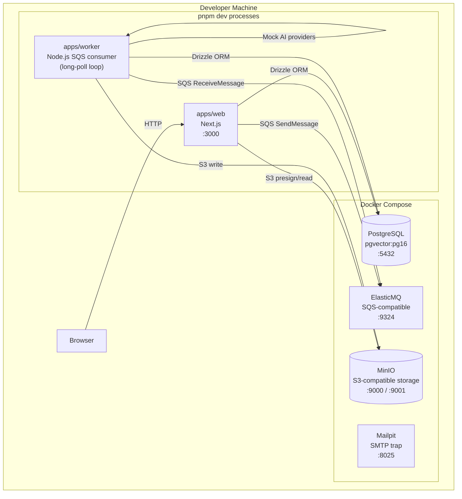
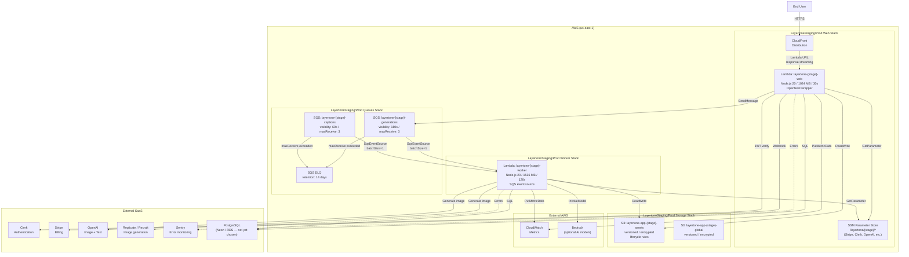
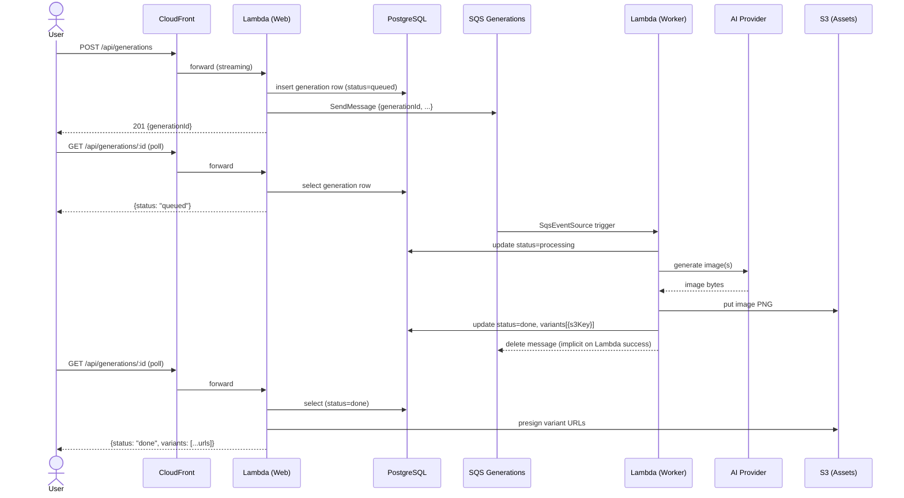
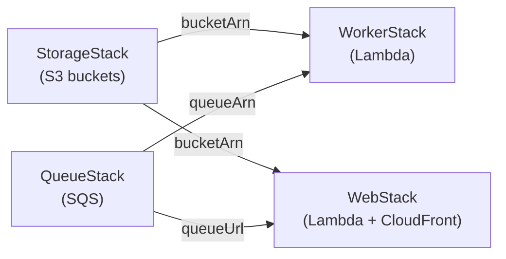

# Deployment Architecture

Layertone deployment plan. Two environments described: **local development** and **AWS cloud (target)**.

---

## 1. Local Development

Runs on Docker Compose (`compose.yaml`) plus two pnpm dev processes.

### Local mode flags

| `AI_MODE` | `QUEUE_MODE` | Use case |
|-----------|-------------|----------|
| `mock` | `elasticmq` | UI, flow, storage testing (no API cost) |
| `real` | `elasticmq` | Real OpenAI/Replicate, local infra |
| `mock` | `inline` | Unit/integration tests (in-process) |

---

## 2. AWS Cloud Target (CDK)

Four independent CDK stacks in `infra/`. Fully serverless — no long-running EC2 or containers.

---

## 3. Request Data Flow — Image Generation

End-to-end path from user clicking Generate to seeing results.

---

## 4. CDK Stack Dependency Graph

---

## 5. Package → Runtime Map

Which monorepo packages run where at cloud runtime.

| Package | Web Lambda | Worker Lambda | Build-time only |
|---------|-----------|---------------|-----------------|
| `apps/web` | ✓ | | |
| `apps/worker` | | ✓ | |
| `packages/api` | ✓ | ✓ | |
| `packages/auth` | ✓ | | |
| `packages/billing` | ✓ | ✓ | |
| `packages/db` | ✓ | ✓ | |
| `packages/gateway` | | ✓ | |
| `packages/observability` | ✓ | ✓ | |
| `packages/queue` | ✓ | ✓ | |
| `packages/renderer` | | ✓ | |
| `packages/shared` | ✓ | ✓ | |
| `packages/storage` | ✓ | ✓ | |

---

## 6. Open Items / Not Yet Decided

| Item | Status | Notes |
|------|--------|-------|
| PostgreSQL host | **Not chosen** | Neon (serverless), RDS, or other. pgvector required. Recommendation: Neon. |
| Stage env vars | **Placeholder** | Must be populated via `aws ssm put-parameter` before deploy. Nine params: `STRIPE_SECRET_KEY`, `STRIPE_WEBHOOK_SECRET`, `CLERK_SECRET_KEY`, `CLERK_WEBHOOK_SECRET`, `OPENAI_API_KEY`, `ANTHROPIC_API_KEY`, `REPLICATE_API_TOKEN`, `RECRAFT_API_KEY`, `SENTRY_DSN`. |
| CDK deploy CI | **Set up** | `.github/workflows/deploy.yaml` is fully implemented: staging deploy on push to main, production after staging succeeds. Uses OIDC role assumption. |
| Captions worker entry | **Verified** | `apps/worker/src/caption-handler.ts` — `CaptionWorker` class fully implemented. Reads caption job, calls OpenAI text model, stores output, commits/releases credits via Ledger. |
