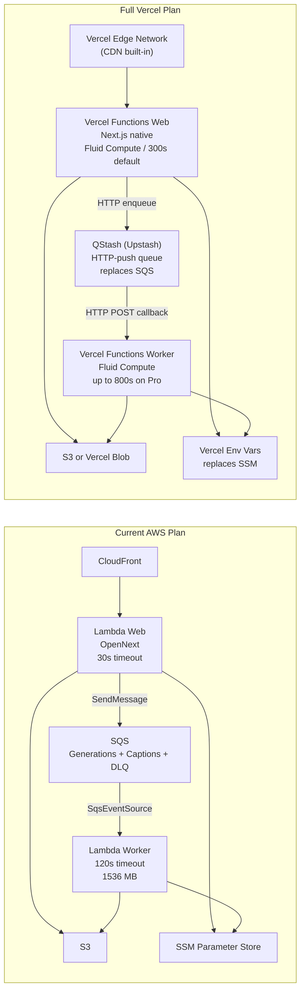
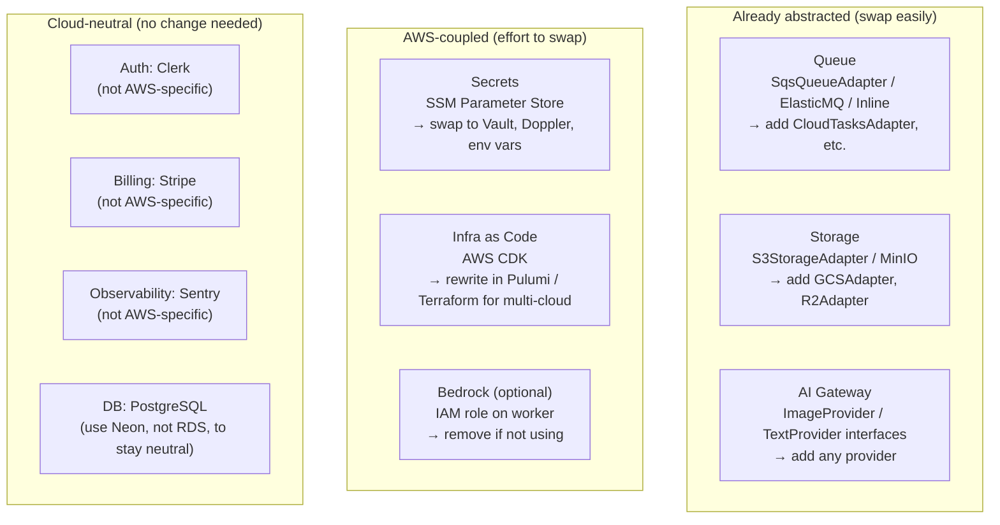

# Serverless Strategy: Honest Opinion + AWS vs Vercel Analysis

---

## 1. Honest Opinion: Is Serverless Right for This App?

**Yes — this app is an excellent fit for serverless, and it was already designed that way.**

Here is why it fits:

- **Bursty, not constant load.** Image generation jobs arrive in batches, not steady streams. You pay for compute only when jobs run. An always-on server would be idle most of the time.
- **SQS decoupling already exists.** The worker is already event-driven. Serverless is the natural runtime for an event-driven consumer.
- **AI API calls are the actual bottleneck.** Lambda sits waiting for OpenAI/Replicate to respond. You are paying for wall-clock time in that wait whether you use Lambda or a container — but Lambda is orders of magnitude cheaper per-idle-second.
- **Renderer uses `@sparticuz/chromium`.** The renderer already has the Lambda-optimized Chromium binary as a dependency. This was a deliberate design choice that shows the app was built with serverless in mind from day one.
- **OpenNext wraps the web app.** `open-next.config.ts` already configures `aws-lambda-streaming` mode. The build pipeline is ready.
- **Storage and queue are already abstracted.** `SqsQueueAdapter`, `StorageAdapter`, and their MinIO/ElasticMQ local equivalents mean the core business logic has no direct cloud-SDK dependency.

**The one non-serverless piece is PostgreSQL.** The current plan leaves the DB host unresolved. This is the only item that would make the system "not fully serverless." Options:
- **Neon** (recommended) — serverless Postgres with pgvector support, scales to zero, pay per compute second
- **PlanetScale** — does not support pgvector, not suitable
- **Aurora Serverless v2** — pgvector supported, AWS-native, more expensive at low scale than Neon
- **RDS (standard)** — always-on, not serverless, but cheapest at steady load

**Recommendation: use Neon.** It supports pgvector, scales to zero, and has a generous free tier for early-stage.

---

## 2. Current AWS Lambda Plan — Evaluation

The CDK stacks are well-structured. A few things to verify before first deploy:

| Item | Assessment |
|------|-----------|
| Worker timeout 120s | Adequate for most AI calls. Watch for Replicate async mode — if jobs exceed this, use SQS visibility timeout + polling instead |
| Web Lambda 30s timeout | Fine for API routes. Long-polling generation status should be short; streaming SSE may need the 30s window |
| Worker memory 1536 MB | Generous — Puppeteer/Chromium needs ~512–900 MB minimum. Keep this |
| Web Lambda 1024 MB | Standard for Next.js. Fine to start, reduce if cost is a concern after profiling |
| Lambda response streaming | Enabled (`InvokeMode.RESPONSE_STREAM`). Good — avoids 6 MB Lambda payload limit for large pages |
| SSM Parameter Store for secrets | Correct pattern. Avoid Lambda environment variables for secrets in production |
| CloudFront in front of Lambda URL | Correct — do not expose Lambda Function URLs directly. CloudFront handles TLS, caching headers, and WAF |

---

## 3. AWS Lambda vs Vercel — Side-by-Side

### 3.1 What Changes Moving to Vercel

**Correction from initial analysis:** Vercel Fluid Compute (enabled by default for new projects since April 2025) supports function execution up to **800 seconds on Pro/Enterprise** — more than the current 120s Lambda worker target. The worker CAN move to Vercel.

The one real constraint is the trigger mechanism. Vercel functions are **HTTP-triggered**, not SQS-triggered. You cannot point an SQS queue at a Vercel function. The standard solution is to replace SQS with **QStash (Upstash)**, which is an HTTP-push message queue designed specifically for this pattern. The codebase's `QueueAdapter` abstraction means this is a new adapter, not a core rewrite.

**What needs to change for full Vercel:**

| Component | Change required | Effort |
|-----------|----------------|--------|
| Web app | `open-next.config.ts` switch from `aws-lambda-streaming` to Vercel adapter | 1–2 hours |
| Worker entry point | New `apps/worker/src/vercel-handler.ts` — wraps handler as HTTP POST route | 1 day |
| Queue | Write `QStashQueueAdapter` implementing existing `QueueAdapter` interface | 1–2 days |
| Queue bootstrapping | Replace `queue:bootstrap` script (ElasticMQ setup) with QStash topic config | 0.5 day |
| Secrets | Move from SSM `GetParameter` calls to `process.env` populated by Vercel dashboard | 1 day |
| CDK removal | Delete `infra/` CDK stacks for web and worker (keep nothing, or keep S3 stack if using S3) | 0.5 day |
| Storage | Keep S3 or switch to Vercel Blob (both work; S3 keeps more flexibility) | optional |
| **Total** | | **~4–6 days** |

**What does NOT change:** all of `packages/api`, `packages/gateway`, `packages/renderer`, `packages/db`, `packages/auth`, `packages/billing`. The business logic is untouched.

---

### 3.2 Complexity Comparison

| Concern | AWS CDK (current plan) | Full Vercel + QStash |
|---------|----------------------|---------------------|
| **Initial setup** | High — CDK, IAM roles, SSM params, 4 stacks to deploy | Low — `vercel deploy`, QStash dashboard config |
| **CI/CD** | You write it (GitHub Actions + CDK deploy) | Vercel auto-deploys on push, preview per branch built-in |
| **Web deployment** | OpenNext build + Lambda zip upload | Native Next.js deploy, zero config |
| **Worker deployment** | Lambda zip + SQS trigger wired in CDK | Vercel function with HTTP endpoint, QStash callback |
| **Worker timeout** | 120s (configurable up to 15 min) | 800s on Pro (Fluid Compute) — more generous |
| **Secrets management** | SSM Parameter Store (per-stage, fine-grained) | Vercel dashboard (project-scoped, simpler) |
| **Custom domains** | CloudFront + Route 53 (manual) | Vercel dashboard (one-click) |
| **Cold starts** | ~1–3s for Node.js Lambda | ~200–800ms (Fluid Compute keeps instances warm longer) |
| **Observability** | CloudWatch + Sentry | Vercel built-in logs + Sentry |
| **Rollbacks** | Re-deploy CDK | One-click in Vercel dashboard |
| **Preview environments** | Not easy to wire up | Built-in — every PR gets a URL |
| **Infrastructure as code** | CDK TypeScript — version-controlled | Minimal IaC needed; QStash config is light |
| **Queue reliability** | SQS DLQ, visibility timeout, exactly-once-ish | QStash retries, DLQ, at-least-once delivery |
| **Vendor lock-in** | AWS (IAM, SQS, SSM, Lambda, CloudFront) | Vercel + Upstash (both are single-vendor, different vendors) |
| **Team ops burden** | Medium-high (IAM policies, CDK upgrades, Lambda layers) | Low — both Vercel and Upstash are fully managed |

**Verdict:** Full Vercel is now a genuinely viable option for both web and worker. It is simpler to operate and deploy, and Fluid Compute removes the timeout concern. The trade-off is: you pay the Vercel Pro flat fee, and you give up the fine-grained cost-per-GB-second pricing of Lambda (which matters at very high scale).

---

### 3.3 Cost Comparison

Estimates for a **small production app** (~10,000 image generation jobs/month, ~50,000 web requests/day).

#### AWS CDK Plan (Lambda + SQS + S3 + CloudFront)

| Service | Est. Monthly Cost |
|---------|------------------|
| Lambda (web) — 50k req/day × 30 days × 0.5s avg × 1024 MB | ~$4–8 |
| Lambda (worker) — 10k jobs × 30s avg × 1536 MB | ~$6–12 |
| SQS — 10k messages + polling | ~$0.01 |
| S3 — 10k images ~1 MB each = 10 GB + transfers | ~$2–5 |
| CloudFront — 50k req/day, ~5 GB transfer | ~$3–6 |
| SSM Parameter Store (standard) | Free |
| **Total estimate** | **~$15–31/month** |

#### Full Vercel Plan (Web + Worker on Vercel + QStash)

| Service | Est. Monthly Cost |
|---------|------------------|
| Vercel Pro — web + worker functions | $20/month flat |
| Vercel function compute beyond included quota | ~$0–5 (10k jobs × 30s is within Pro limits) |
| QStash (Upstash) — 10k messages/month | ~$0 (free tier: 500/day = 15k/month) |
| S3 or Vercel Blob — 10k images ~10 GB | ~$2–5 |
| **Total estimate** | **~$22–30/month** |

**Cost notes:**
- At **small scale** (10k jobs/month), both options cost roughly the same. Vercel Pro's flat fee dominates.
- At **medium scale** (100k jobs/month), AWS Lambda pulls ahead: you pay per-execution vs Vercel's per-unit overages. QStash free tier also runs out at ~100k/month (paid plan ~$10/month after that).
- At **high scale** (1M+ jobs/month), AWS Lambda is significantly cheaper per-unit. Vercel's per-GB-second cost is higher than Lambda's.
- **Vercel's advantage is developer time cost, not compute cost.** If faster CI/CD, preview environments, and zero ops save meaningful engineering hours, the $5–10/month premium is worth it early.
- Neither estimate includes the database (Neon free tier for early stage; ~$19/month after).
- Neither includes AI API costs — these dominate at any real scale.

---

## 4. Provider-Agnosticism: Current State and Gaps

The codebase is already more provider-agnostic than most apps. Here is the honest inventory:

### What would full provider-agnosticism require?

| Item | Effort | What to do |
|------|--------|-----------|
| Queue | Low | Already abstracted. Add an adapter for the target provider's queue (e.g., Google Cloud Tasks, Cloudflare Queues) |
| Storage | Low | Already abstracted. Add a GCS or R2 adapter |
| Secrets | Medium | Replace SSM reads with `process.env` or a cloud-neutral secret manager (Doppler, 1Password Secrets) |
| Web runtime | Low | OpenNext supports AWS Lambda, Vercel, Cloudflare Workers, and Node.js server. Switch the adapter |
| Worker runtime | Medium | Worker is a plain Node.js process. It can run as Lambda, a container, a Cloud Run job, or a Fly.io machine. No AWS SDK calls in core logic |
| Infra as code | High | Rewrite CDK in Terraform or Pulumi if you want to deploy to GCP/Azure/Cloudflare |
| Database | Low (if Neon) | Neon is not tied to AWS. Avoid RDS |

**Recommendation for maximum agnosticism with minimum effort:**
1. Use Neon for PostgreSQL (not RDS)
2. Replace SSM Parameter Store lookups with plain `process.env` in Lambda, populated by your deploy tool or Doppler
3. Keep OpenNext (it's multi-target by design)
4. Keep the SQS adapter but add a queue name config that could point anywhere

The core business logic (`packages/api`, `packages/gateway`, `packages/renderer`) is already cloud-free. The lock-in is thin and at the infrastructure edges.

---

## 5. Recommendation Summary

| Decision | Recommendation | Reason |
|----------|---------------|--------|
| Serverless? | **Yes** | Perfect fit — bursty workload, event-driven worker, already designed for it |
| Platform choice | **Two viable options — see below** | AWS CDK wins on cost at scale; Vercel wins on ops simplicity |
| Database | **Neon** | pgvector, serverless, not AWS-locked, free tier for early stage |

### Option A — AWS CDK (current plan, deploy as-is)

**Choose this if:** cost efficiency at scale matters more than ops simplicity, or you want full control over IAM and infrastructure.

- Deploy the 4 CDK stacks as written
- Add Neon for PostgreSQL
- Replace SSM placeholder values before deploying
- ~$15–31/month at small scale

### Option B — Full Vercel + QStash

**Choose this if:** you want the fastest path to production with the least ops overhead, especially valuable while still iterating quickly.

- Web: switch `open-next.config.ts` to Vercel adapter
- Worker: new HTTP endpoint handler + QStash adapter in `packages/queue`
- Fluid Compute gives up to 800s function duration — more than current 120s Lambda
- ~4–6 days of migration work
- ~$22–30/month at small scale

### Migration path from Option B back to A (if needed)

Because the queue, storage, and AI gateway are abstracted, you can switch back at any time:
1. Write an `SqsQueueAdapter` (already exists) — swap in for `QStashAdapter`
2. Switch `open-next.config.ts` back to `aws-lambda-streaming`
3. Re-deploy CDK stacks

The business logic never changes. Migration is at the infrastructure edges only.
